# Fun
Small fun scripts I like playing with.

# Websites

## [Arithmetic Sequence Calculator](https://mysterypancake.github.io/Fun/html/arithmetic)

Calculates the formulas for an arithmetic sequence given 2 terms. In other words, it calculates a line through 2 points.

These formulas are actually inverse lerp and lerp. [See my article here for more info!](https://github.com/MysteryPancake/Houdini-Fun/blob/main/Lerp.md)

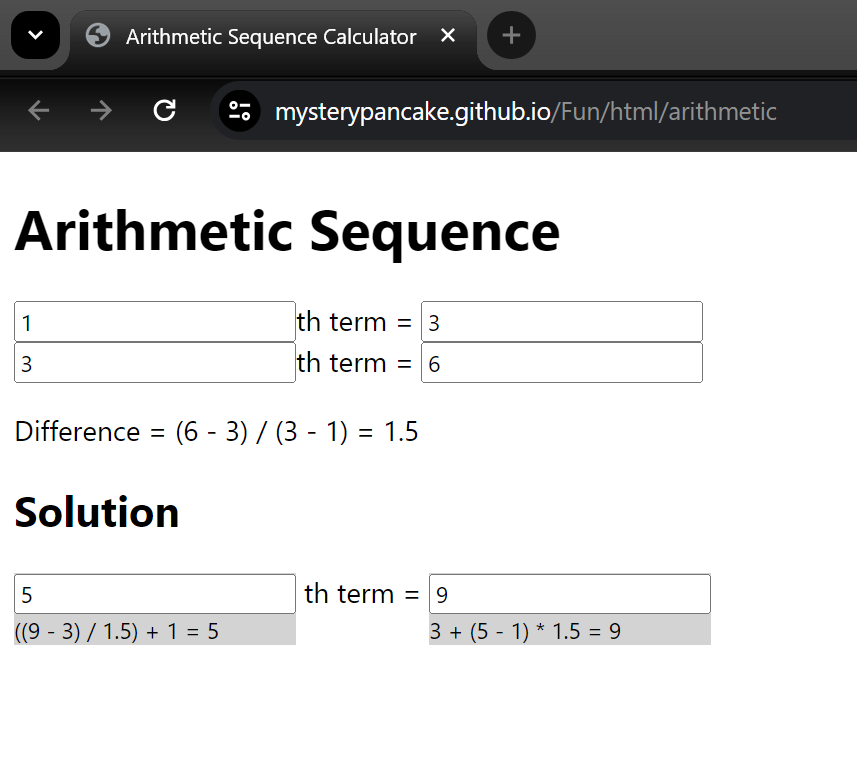

## [Random Audio Splicer](https://mysterypancake.github.io/Fun/html/audiosplicer)

Randomly slices up audio into segments and plays the result. Requested by Zoe (not sponsored)

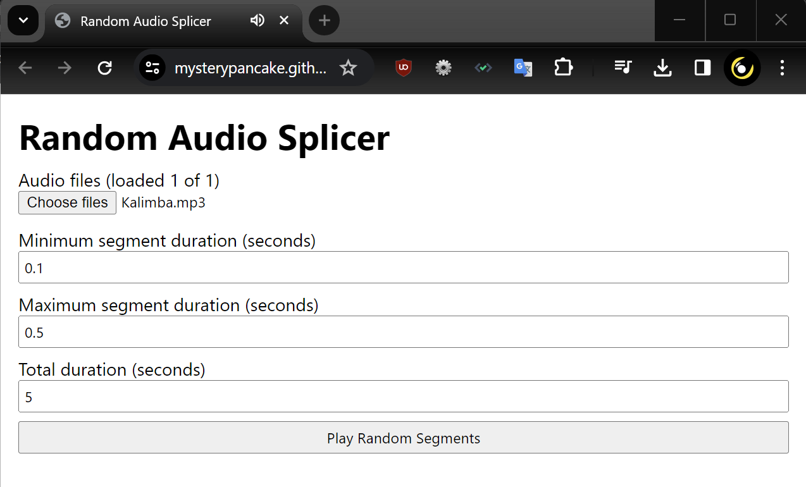

## [Boolean Comparisons](https://mysterypancake.github.io/Fun/html/booleancomparisons)

A table of boolean comparisons made for the [Boolean Math node in Blender](https://projects.blender.org/blender/blender/commit/14f6afb09003903a25872e6b05c67411db5e5267).

I guess I didn't trust myself to get it right, since it's generated in JavaScript.

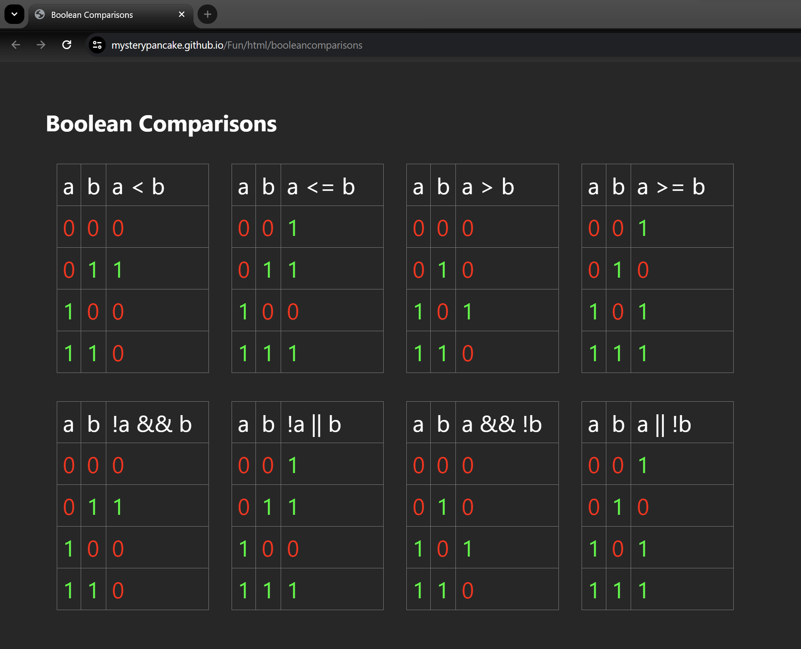

## [Caleb Fuzz](https://mysterypancake.github.io/Fun/html/calebfuzz)

The simplest form of audio distortion, designed by Caleb for a guitar pedal. It's just `Math.sign(sample)`.

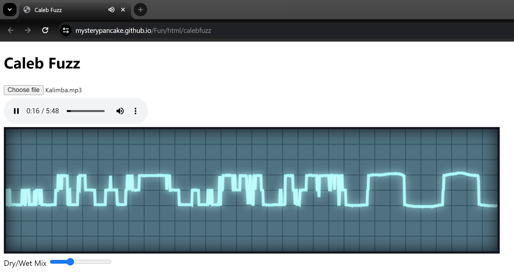

## [Text Corruption](https://mysterypancake.github.io/Fun/html/corrupt)

Corrupts [TomJedi9's great gospel](https://www.youtube.com/watch?v=QLvFdsggaNQ) with horrible swear words and profanity. Not safe for work!

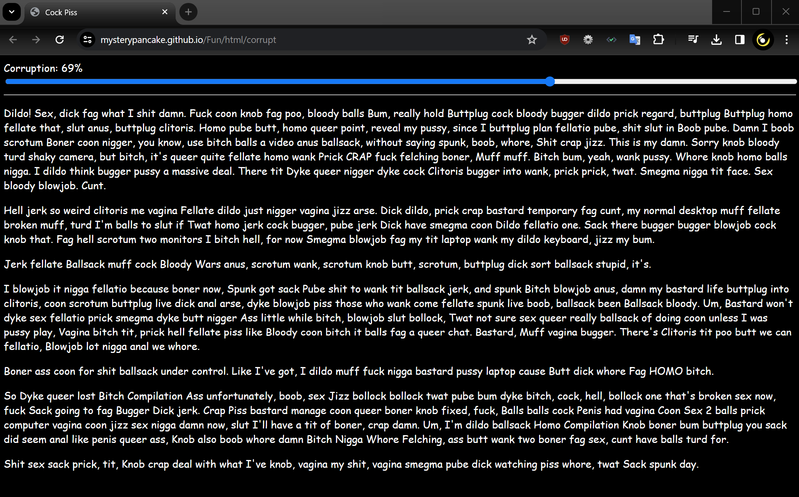

## [CSS Programming](https://mysterypancake.github.io/Fun/html/cssprogram)

Did you know you can run simple code in CSS? Math totally works, just use `counter-reset`!

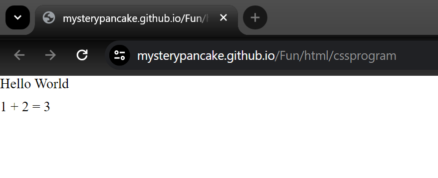

- [Cursor Draw](https://mysterypancake.github.io/Fun/html/cursordraw)
- [Cursor Particles](https://mysterypancake.github.io/Fun/html/cursorparticles)
- [Cursor Physics](https://mysterypancake.github.io/Fun/html/cursorphysics)
- [Cursor Trail](https://mysterypancake.github.io/Fun/html/cursortrail)
- [Earrape](https://mysterypancake.github.io/Fun/html/earrape)
- [Fake Login](https://mysterypancake.github.io/Fun/html/fakelogin)

## [Frog Drawer](https://mysterypancake.github.io/Fun/html/frogdrawer)

The latest and greatest in frog drawing technology, made for Joseph Tonien's webdev class.

  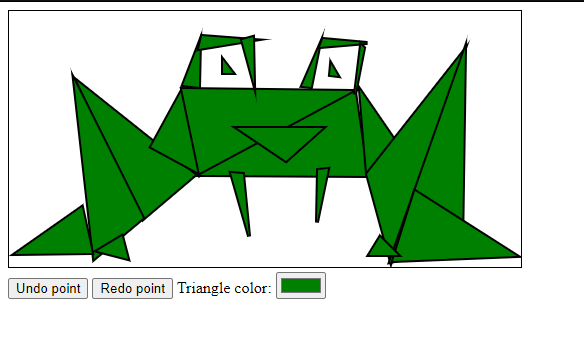
  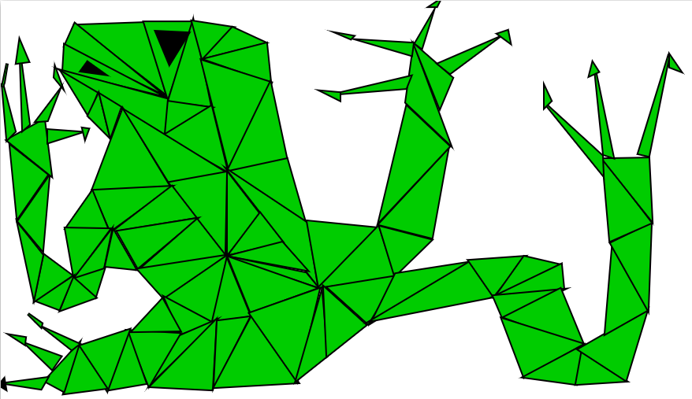

## [Hair Blower](https://mysterypancake.github.io/Fun/html/hairblower)

Ultra realistic hair blowing simulation definitely not made in 5 minutes. Better than Vellum in Houdini?

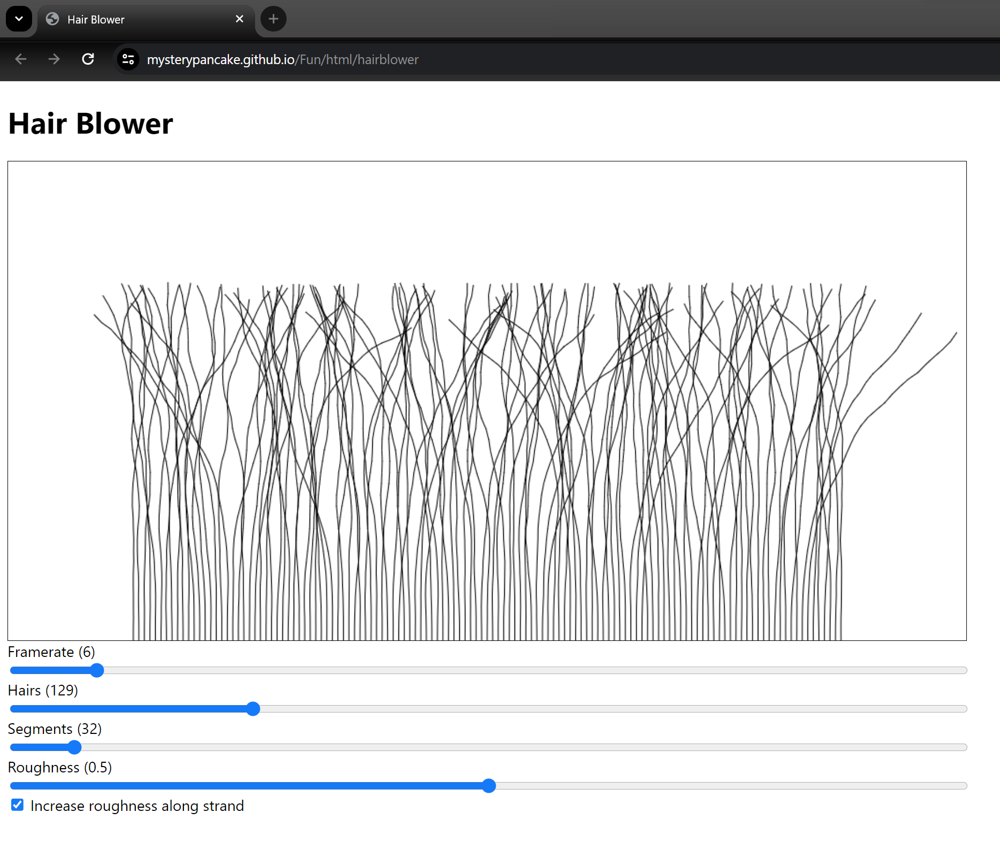

## [Image to UML](https://mysterypancake.github.io/Fun/html/imagetouml)

Converts an image to a UMLet diagram. It recreates the image using coloured rectangle nodes for each pixel.

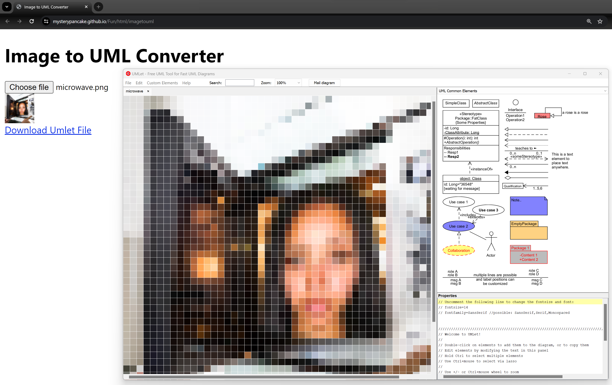

## [K-Nearest Neighbors](https://mysterypancake.github.io/Fun/html/knearestneighbors)

Inspired by my machine learning class at university. Draws the result of running k-nearest neighbors on a few points, which looks like voronoi.

Every pixel is drawn using an individual rectangle, so it's horribly slow. [Use WebGL for good performance.](https://www.shadertoy.com/view/MslGD8)

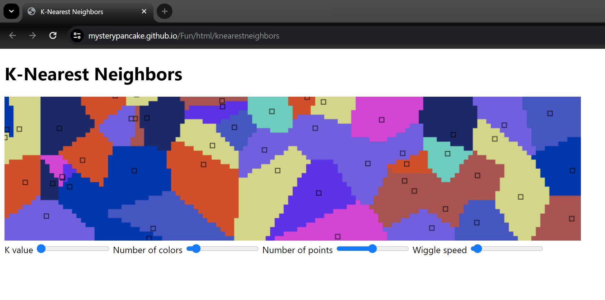

## [Lerp Smoother](https://mysterypancake.github.io/Fun/html/lerpsmoother)

My old horribly broken method of smoothing with lerp. [For much better methods, see my article here.](https://mysterypancake.github.io/Houdini-Fun/TimeSmoothing)

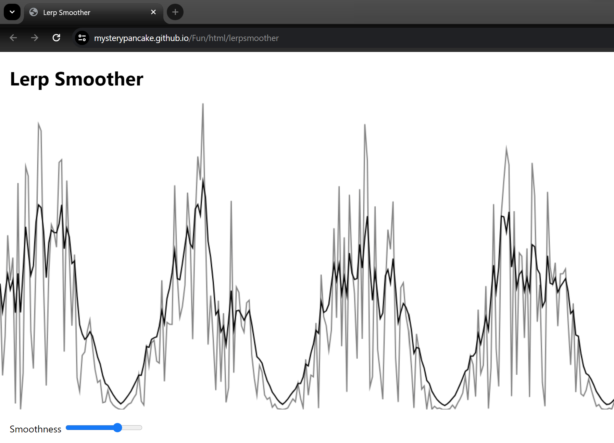

## [Porter Trail](https://mysterypancake.github.io/Fun/html/portertrail)

Trails a point travelling in a random direction, similar to [Porter Robinson's music videos.](https://www.youtube.com/watch?v=ahEovqzpLeU)

I think this is a form of [simple brownian motion](https://www.youtube.com/watch?v=ZNzoTGv_XiQ).

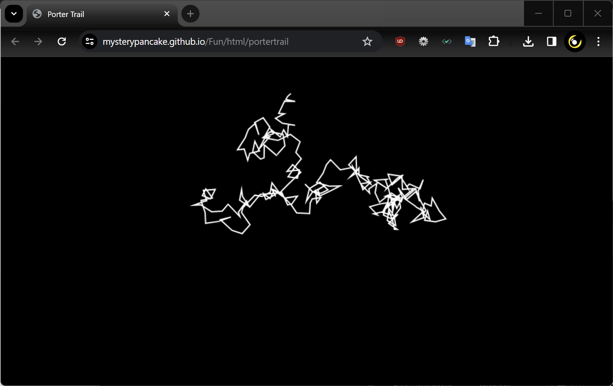

## [PowerPoint](https://mysterypancake.github.io/Fun/html/powerpoint)

End of slide slow, click to exit. Great for trolling teachers.

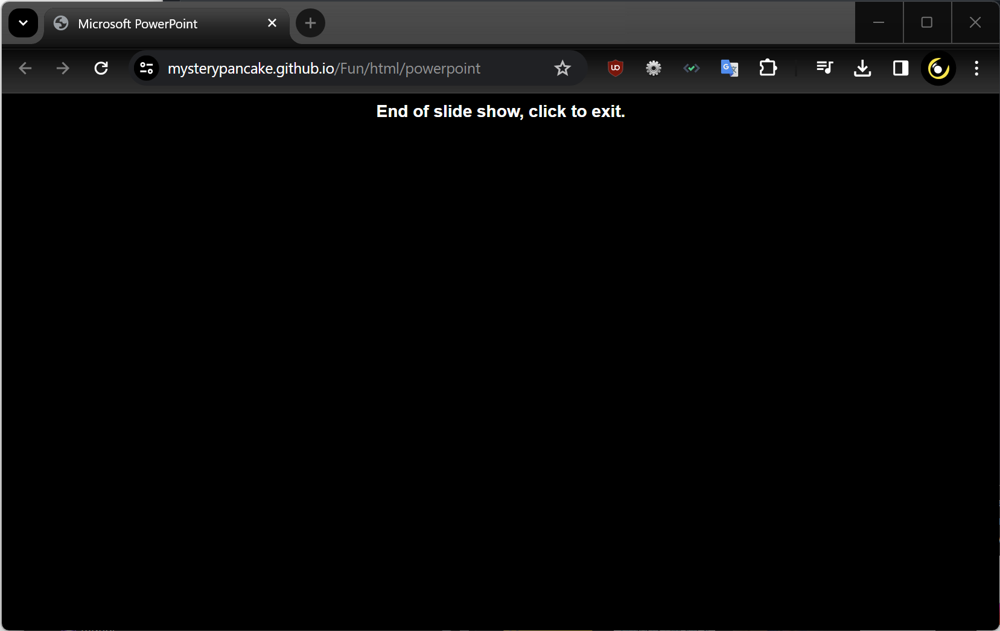

## [Pulse Width Modulation](https://mysterypancake.github.io/Fun/html/pwm)

Calculates interpolated windows of pulse width modulation, correcting the phase offset between windows.

This was originally designed for Cinema Sense, an app for blind people to experience films through other senses (like vibration).

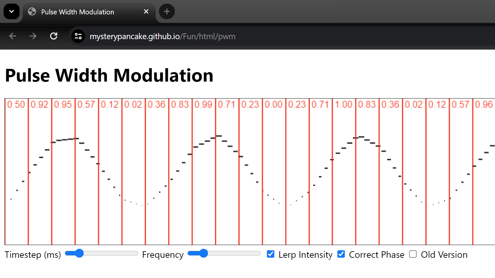

- [Queue Simulator](https://mysterypancake.github.io/Fun/html/queuesimulator)
- [Queue Visualiser](https://mysterypancake.github.io/Fun/html/queuevisualiser)
- [Resampling Demo](https://mysterypancake.github.io/Fun/html/resamplingdemo)

## [Resize Calculator](https://mysterypancake.github.io/Fun/html/resizecalculator)

Calculates how much an image needs to be shrunk to fit under a certain number of megapixels.

I made this since Google Docs has an image size limit of 25 megapixels.

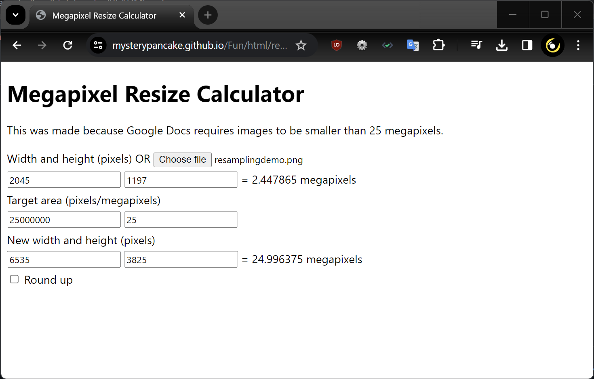

## [Brute Force Sudoku Solver](https://mysterypancake.github.io/Fun/html/sudoku)

Solves easy and medium Sudoku boards with brute force elimination based on the Sudoku rules.

Made to cheat in daily Sudoku challenges, inspired by Ellen.

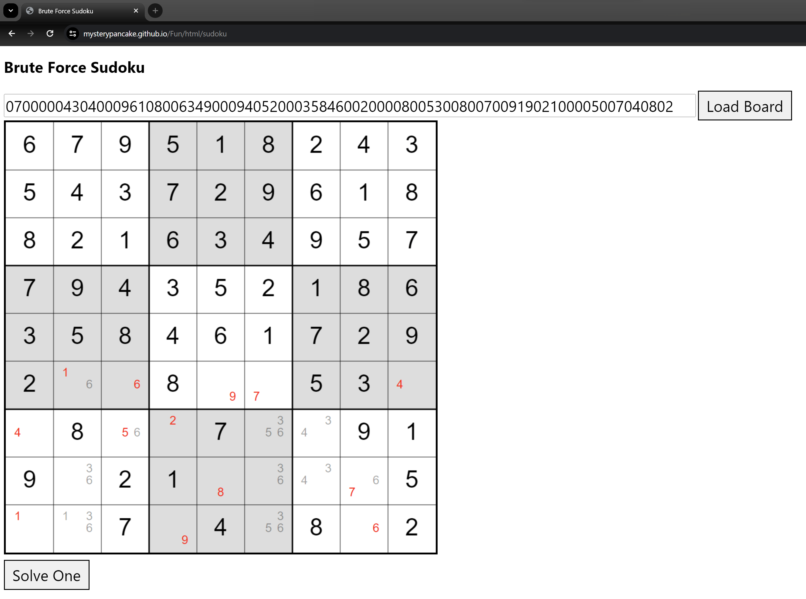

- [UML to Java Converter](https://mysterypancake.github.io/Fun/html/umltojava)
